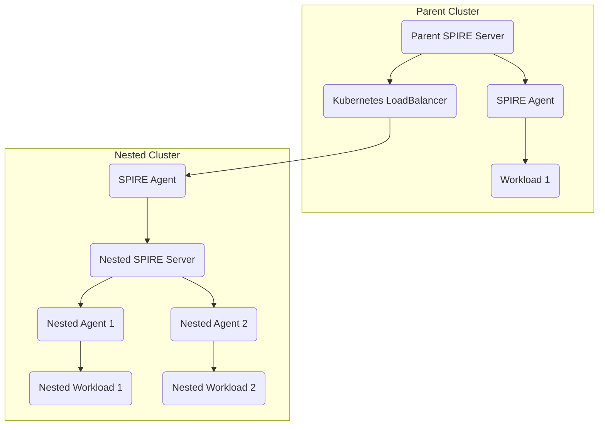

# spire-diagrams
Some diagrams of SPIRE deployment architectures (UNOFFICIAL)

These may be useful for documentation or presentations, but they haven't been reviewed and aren't an official part of SPIRE documentation.

# Sequence diagram

# Nested SPIRE

